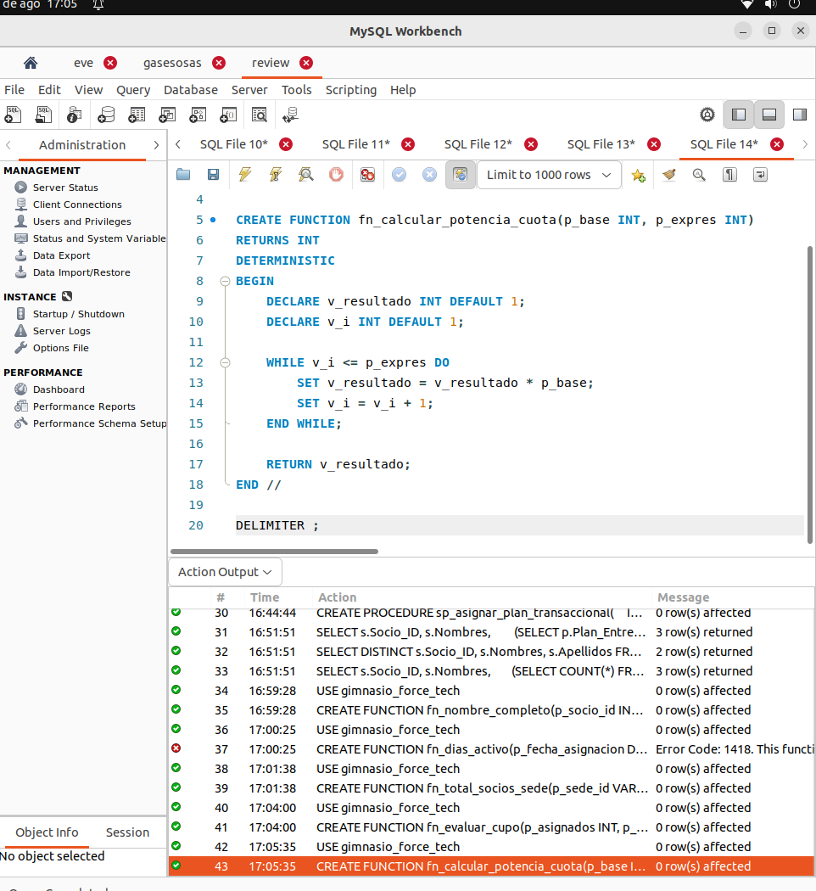
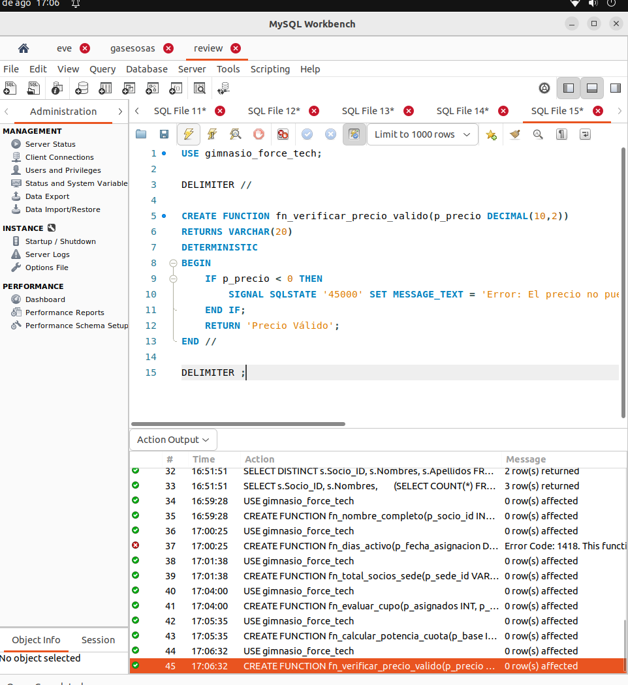
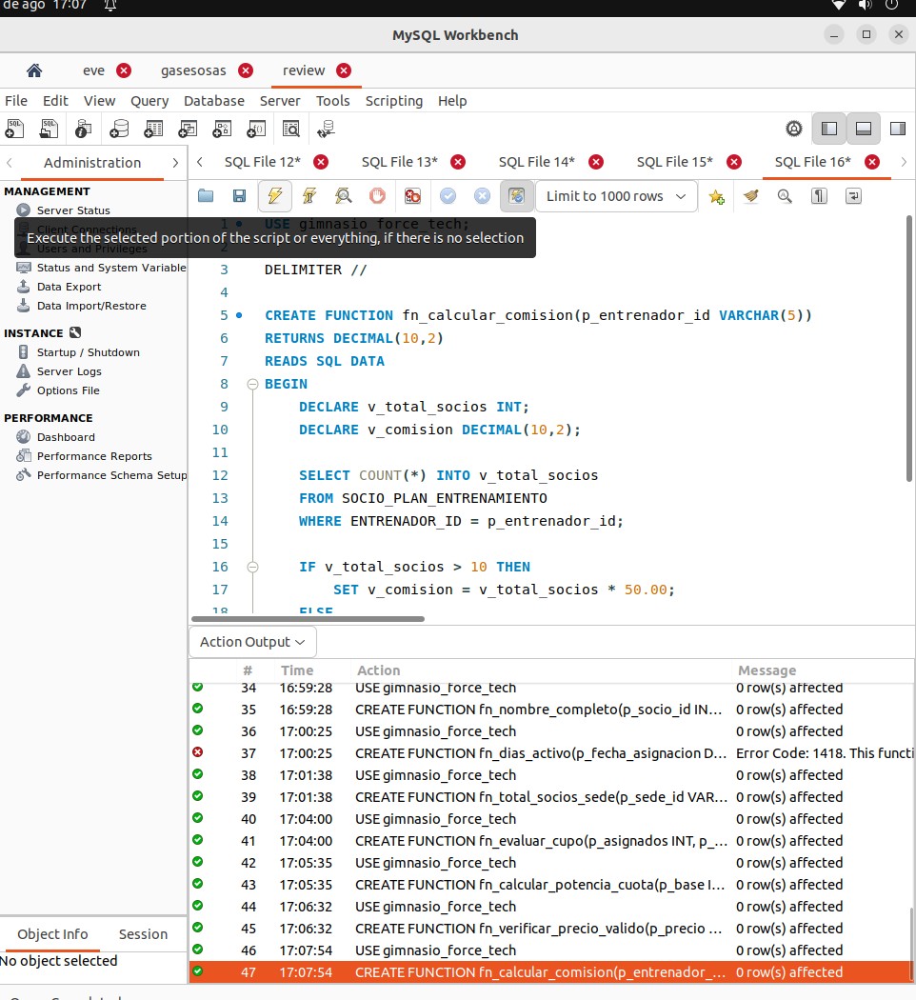

## ejecuciones de auerdo al ejemplo de cada archivo

# 1. funcion_simple

# 2. funciones no deterministicas

# 3. funcion acceso db

# 4. funcion con condicion

# 5. funciones con bucles

# 6. funciones manejo de errores 

# 7. declarar comision entrenador
